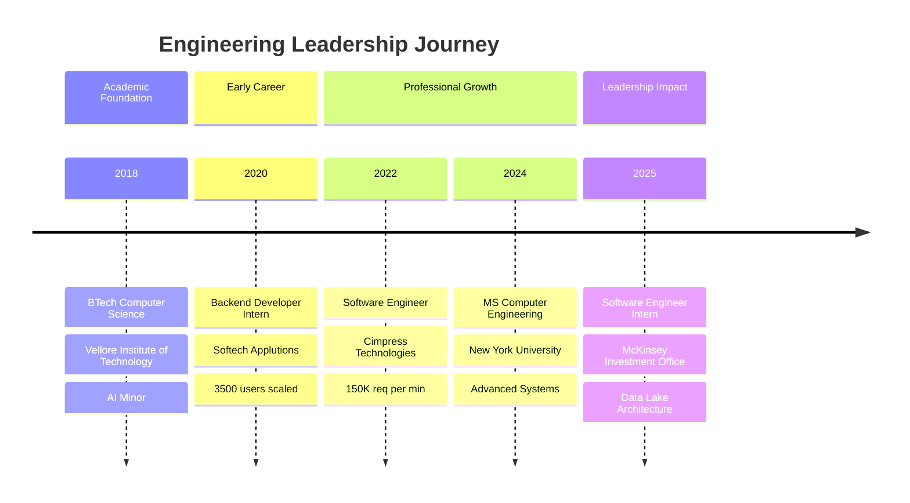
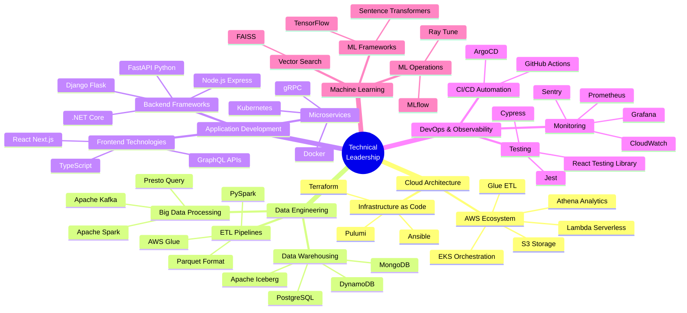

---

## 🎯 EXECUTIVE SUMMARY

**Technology Leader | Cloud Infrastructure Architect | Data Engineering Strategist**

*Driving measurable business impact through scalable distributed systems and high-performance data pipelines*

Results-oriented engineering leader with a proven track record of delivering enterprise-scale solutions that drive revenue growth and operational efficiency. Currently pursuing MS Computer Engineering at NYU, with 3+ years of hands-on experience architecting cloud-native systems, optimizing data infrastructure, and leading cross-functional technical initiatives. Demonstrated expertise in reducing operational costs by 30%, accelerating deployment cycles by 40%, and scaling systems to handle 150K+ requests per minute while maintaining 99.7% uptime.

### 📊 LEADERSHIP IMPACT DASHBOARD

| **Metric** | **Achievement** | **Business Value** |
|:-----------|:----------------|:-------------------|
| **System Performance** | 150K+ req/min throughput | 30% latency reduction across global regions |
| **Deployment Velocity** | 40% faster pipeline | 13-min deployments (down from 22 min) |
| **Cost Optimization** | 30% I/O efficiency gain | Significant infrastructure cost savings |
| **Analyst Productivity** | 120 hours saved/quarter | 60% reduction in data-related tickets |
| **Scale Achievement** | 3,500+ active users | 99.7% uptime with 10K+ req/min |
| **Team Collaboration** | Cross-functional leadership | Quant teams, analysts, accessibility engineers |

---

## 💼 STRATEGIC LEADERSHIP PHILOSOPHY

> "Engineering excellence is measured not by lines of code, but by measurable business outcomes, team empowerment, and sustainable system architecture that scales with organizational growth."

My leadership approach centers on three core principles:

**1. Business-First Engineering** — Every architectural decision is evaluated against clear business metrics: revenue impact, cost efficiency, and customer value delivery. Technical excellence serves business objectives.

**2. Team Enablement & Mentorship** — Building high-performing teams through knowledge sharing, collaborative problem-solving, and creating environments where engineers can do their best work. Success is measured by team growth, not individual heroics.

**3. Scalable Systems Thinking** — Designing infrastructure that anticipates future growth, balances technical debt against velocity, and creates leverage through automation, standardization, and strategic technology choices.

---

## 🚀 STRATEGIC IMPACT & BUSINESS VALUE

### McKinsey Investment Office (MIO Partners) — Software Engineer Intern
**May 2025 - Aug 2025 | Strategic Data Infrastructure Transformation**

#### Key Strategic Initiatives:

**Data Lake Architecture (Serverless Trade Operations)**
- **Business Impact**: Reduced trade retrieval cycles from 14 minutes to 6 minutes, reclaiming 120 analyst hours per quarter
- **Technical Leadership**: Architected MIO's inaugural serverless data lake integrating AWS Glue, Apache Iceberg, and Athena
- **Scale Achievement**: Processing 2.1M trade rows daily with Apache Spark 3.4
- **Strategic Value**: Replaced legacy retrieval methods with modern cloud-native architecture

**Performance Optimization (Trade Extract Pipeline)**
- **Business Impact**: Reduced p95 fetch latency from 110s to 33s through parallelization
- **Technical Innovation**: Redesigned pipeline on Parquet and Presto with 16-worker parallel scans
- **Future-Proofing**: Implemented schema evolution enabling attribute additions without redeployment
- **Operational Excellence**: Enabled analysts to adapt to changing requirements independently

**API Standardization & Developer Experience**
- **Business Impact**: Eliminated bottleneck of 40+ ad-hoc Python scripts, reducing support tickets by 60%
- **Technical Leadership**: Shipped standardized IAM-scoped REST APIs and PySpark ETL jobs
- **Team Enablement**: Streamlined data-pull workflow for downstream analysts
- **Knowledge Management**: Centralized data access patterns and best practices

**Quality Assurance & Production Readiness**
- **Business Impact**: Successfully caught race-condition bugs before Q4 close
- **Cross-Functional Leadership**: Partnered with quant teams on schema design and load testing
- **Documentation Excellence**: Created comprehensive migration playbook in Confluence
- **Risk Mitigation**: Pre-production validation prevented costly production incidents

**Technologies**: AWS Glue, Apache Iceberg, Athena, Apache Spark 3.4, Parquet, Presto, Python, REST APIs, PySpark, IAM, Confluence

---

### Cimpress Technologies — Software Engineer
**Aug 2022 - Aug 2024 | High-Performance Pricing Infrastructure**

#### Key Strategic Initiatives:

**Global Pricing Architecture (Multi-Region Performance)**
- **Business Impact**: Supported 150K+ requests per minute with 30% latency reduction
- **Technical Leadership**: Re-engineered core .NET and Node.js services for high-volume traffic
- **Global Scale**: Achieved consistent page-load performance across three geographic regions
- **Database Optimization**: Targeted I/O improvements delivering measurable performance gains

**API Modernization & Developer Experience**
- **Business Impact**: Reduced end-to-end latency by 25%, stabilizing client-side performance
- **Technical Innovation**: Re-engineered pricing workflows with React, GraphQL, and Express
- **Architecture Excellence**: Refined GraphQL API contracts and state management patterns
- **User Experience**: Delivered consistent global performance for pricing applications

**Deployment Pipeline Transformation**
- **Business Impact**: Accelerated deployment by 40%, enabling 60-second live price updates during peak sales
- **Technical Leadership**: Containerized 7 .NET and Node services on Amazon EKS
- **DevOps Excellence**: Implemented blue-green rollouts reducing windows from 22 to 13 minutes
- **Business Agility**: Empowered merchandising team with rapid deployment capabilities

**Accessibility & Quality Engineering**
- **Business Impact**: Raised Lighthouse accessibility scores from 78 to 96
- **Cross-Functional Collaboration**: Partnered with accessibility engineers on React state management
- **Quality Metrics**: Resolved 35% of client-side bugs through Sentry monitoring
- **User Impact**: Significantly improved pricing dashboard stability and accessibility

**Technologies**: .NET Core, Node.js, React, GraphQL, Express, Amazon EKS, Docker, Kubernetes, Sentry, Lighthouse, Blue-Green Deployments

---

### Softech Applutions — Backend Developer Intern
**Jun 2020 - Nov 2020 | Startup Growth & Scalability**

#### Key Strategic Initiatives:

**Full-Stack Backend Development (Trailer 2 You App)**
- **Business Impact**: Scaled to 3,500 users in Australia with 99.7% uptime
- **Technical Achievement**: Handled 10K+ requests per minute via AWS ELB and Auto Scaling Groups
- **Startup Velocity**: Delivered production-ready backend enabling rapid market entry
- **Infrastructure Excellence**: CloudWatch monitoring ensuring reliability at scale

**Real-Time Feature Development**
- **Business Impact**: Reduced data retrieval times by 20% through schema optimization
- **Technical Innovation**: Integrated Socket.io for real-time map tracking
- **Full-Stack Ownership**: End-to-end booking flow from React UI to Node.js/Express backend
- **Database Design**: Optimized MongoDB schemas with Mongoose ORM

**Technologies**: Node.js, Express, MongoDB, AWS ELB, Auto Scaling Groups, CloudWatch, React, Socket.io, Mongoose ORM

---

## 📈 CAREER PROGRESSION TIMELINE

---

## 🏆 KEY ACHIEVEMENTS & BUSINESS METRICS

### Revenue & Cost Impact

**Infrastructure Cost Optimization**
- Achieved 30% reduction in database I/O latency (Cimpress)
- Reduced analyst manual work by 120 hours/quarter (McKinsey MIO)
- Eliminated 40+ ad-hoc scripts reducing maintenance overhead (McKinsey MIO)

**Operational Efficiency Gains**
- 40% faster deployment pipeline (22 min → 13 min) enabling rapid iteration (Cimpress)
- 60% reduction in data-related support tickets through API standardization (McKinsey MIO)
- 60-second live price updates during peak sales events (Cimpress)

**Scale & Performance Achievements**
- Supported 150K+ requests per minute with 30% latency improvement (Cimpress)
- Processed 2.1M trade rows daily with 6-minute retrieval cycles (McKinsey MIO)
- Scaled to 3,500 users with 99.7% uptime handling 10K+ req/min (Applutions)

### Technical Leadership Initiatives

**Architecture & System Design**
- Architected MIO's first serverless data lake (AWS Glue, Iceberg, Athena)
- Re-engineered global pricing architecture across 3 regions (React, GraphQL, .NET)
- Designed real-time booking system with Socket.io integration

**Performance Engineering**
- Reduced p95 fetch latency from 110s to 33s through 16-worker parallelization
- Improved end-to-end API latency by 25% via GraphQL optimization
- Optimized MongoDB schemas reducing data retrieval by 20%

**Quality & Reliability**
- Raised accessibility scores from 78 to 96 (Lighthouse)
- Resolved 35% of client-side bugs through Sentry monitoring
- Prevented production incidents via pre-production load testing

### Cross-Functional Leadership

**Stakeholder Collaboration**
- Partnered with quant teams on schema design and load testing (McKinsey MIO)
- Collaborated with accessibility engineers on state management (Cimpress)
- Enabled merchandising team with rapid deployment capabilities (Cimpress)

**Documentation & Knowledge Sharing**
- Created comprehensive migration playbook in Confluence (McKinsey MIO)
- Standardized data access patterns for analyst teams (McKinsey MIO)
- Implemented schema evolution for self-service attribute additions (McKinsey MIO)

---

## 🛠️ TECHNOLOGY STACK — EXECUTIVE OVERVIEW

### Strategic Technology Decisions

My technology choices are driven by business requirements, team expertise, and long-term maintainability. Each stack component is selected to maximize developer productivity, system reliability, and operational efficiency.

### Core Competencies by Domain

**Cloud & Infrastructure (AWS Specialist)**
- AWS Services: Glue, Athena, Lambda, ECS, EKS, Auto Scaling, S3, IAM
- Infrastructure as Code: Terraform, Pulumi, Ansible
- Container Orchestration: Docker, Kubernetes, Amazon EKS
- CI/CD: GitHub Actions, ArgoCD, Blue-Green Deployments

**Data Engineering & Analytics**
- Big Data: Apache Spark (PySpark), Apache Kafka, Presto
- Data Warehousing: Apache Iceberg, PostgreSQL, MySQL, MongoDB, Redis, DynamoDB
- ETL/ELT: AWS Glue, PySpark, Parquet, Schema Evolution
- RAG Systems: FAISS, Sentence-Transformers, Vector Search

**Application Development**
- Backend: Node.js (Express, Koa), Python (Django, Flask, FastAPI), .NET Core, Java
- Frontend: React, Next.js, Redux, TypeScript, HTML5, CSS3, Tailwind
- APIs: GraphQL, gRPC, REST, WebSockets
- Testing: Jest, Cypress, React Testing Library

**DevOps & Observability**
- Monitoring: Prometheus, Grafana, Sentry, CloudWatch
- CI/CD: GitHub Actions, ArgoCD, Automated Testing
- Performance: Load Testing, Latency Optimization, Auto Scaling

**Machine Learning & AI**
- Frameworks: TensorFlow, Sentence-Transformers, Whisper, Flan-T5
- MLOps: MLflow, Ray Tune, Hyperparameter Optimization
- Vector Search: FAISS, Semantic Search, RAG Pipelines

**Programming Languages**
- Primary: Python, JavaScript/TypeScript, Java
- Additional: C++, SQL, Bash

---

## 🎓 FEATURED STRATEGIC PROJECTS

### 1. Intelligent Multimedia Processing (IMP) for Enterprises
**Enterprise ML System | MLOps Pipeline | Multimodal RAG**

Built an end-to-end ML system automating extraction and indexing of enterprise multimedia, enabling natural-language search and automated meeting minutes generation.

**Strategic Impact:**
- **Business Value**: Automated manual search processes, significantly reducing time spent locating information
- **Technical Innovation**: Architected multimodal RAG pipeline combining Whisper (transcription), Sentence Transformers (semantic search), and Flan-T5-Large (generation)
- **Performance Achievement**: <200ms embedding latency through model quantization and distributed training
- **MLOps Excellence**: Automated CI/CD and continuous-training workflows

**Architecture Highlights:**
- FastAPI serving layer for low-latency inference
- Ray distributed training for model optimization
- Terraform + Ansible + ArgoCD for infrastructure automation
- Continuous training pipeline for model improvement

**Technologies**: Whisper, Sentence Transformers, Flan-T5-Large, FastAPI, Ray, Terraform, Ansible, ArgoCD, MLflow

---

### 2. AI System Design Interview Coach